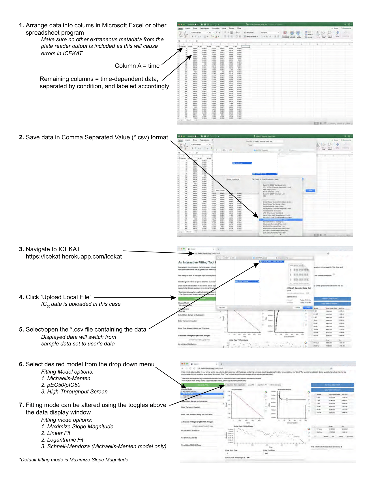

# ICEKAT: An interactive online tool for calculating initial rates from continuous enzyme kinetic traces

## Abstract

### Background
Continuous enzyme kinetic assays are often used in high-throughput applications,
as they allow rapid acquisition of large numbers of kinetic data and increased
confidence compared to discontinuous assays. However, data analysis is often
rate-limiting in high-throughput enzyme assays, as manual inspection and
selection of a linear range from individual kinetic traces is cumbersome and prone
to user error and bias. Currently available software programs are specialized and
designed for the analysis of complex enzymatic models. Despite the widespread
use of initial rate determination for processing kinetic data sets, no simple and
automated program existed for rapid analysis of initial rates from continuous
enzyme kinetic traces.

### Results
An Interactive Continuous Enzyme Kinetics Analysis Tool (ICEKAT) was
developed for semi-automated calculation of initial rates from continuous enzyme
kinetic traces with particular application to the evaluation of Michaelis-Menten
and EC50/IC50 kinetic parameters, as well as the results of high-throughput
screening assays. ICEKAT allows users to interactively fit kinetic traces using
convenient browser-based selection tools, ameliorating tedious steps involved in
defining ranges to fit in general purpose programs like Microsoft Excel and
Graphpad Prism, while still maintaining simplicity in determining initial rates. As
a test case, we quickly analyzed over 500 continuous enzyme kinetic traces
resulting from experimental data on the response of the protein lysine deacetylase
Sirt1 to small-molecule activators.

### Conclusions
ICEKAT allows simultaneous visualization of individual initial rate fits and the
resulting Michaelis-Menten or EC50/IC50 kinetic model fits, as well as hits from
high-throughput screening assays. In addition to serving as a convenient program
for practicing enzymologists, ICEKAT is also a useful teaching aid to visually
demonstrate in real-time how incorrect initial rate fits can affect calculated
Michaelis-Menten or EC50/IC50 kinetic parameters. For the convenience of the
research community, we have made ICEKAT freely available online at
https://icekat.herokuapp.com/icekat.

## Tutorial

